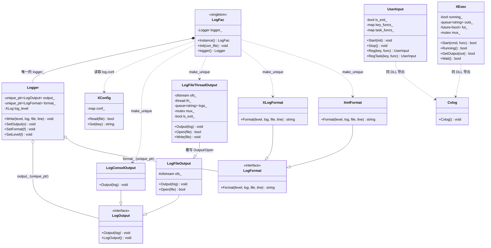

# xlog 模块类关系

`src/xlog/` 是一个轻量日志库，核心是一条「单例工厂负责初始化logger → logger包含 格式器（支持字符串和xml） + 输出器（支持文件和终端）」

## 1. 总体类图

```mermaid
classDiagram
    direction TB

    class LogFac {
        <<singleton>>
        -Logger logger_
        +Instance() LogFac
        +Init(con_file) void
        +logger() Logger
    }

    class Logger {
        -unique_ptr~LogOutput~ output_
        -unique_ptr~LogFormat~ format_
        -XLog log_level
        +Write(level, log, file, line) void
        +SetOutput(o) void
        +SetFormat(f) void
        +SetLevel(l) void
    }

    class LogOutput {
        <<interface>>
        +Output(log)* void
        +LogOutput() void
    }

    class LogConsolOutput {
        +Output(log) void
    }

    class LogFileOutput {
        #ofstream ofs_
        +Output(log) void
        +Open(file) bool
    }

    class LogFileThreadOutput {
        -ofstream ofs_
        -thread th_
        -queue~string~ logs_
        -mutex mux_
        -bool is_exit_
        +Output(log) void
        +Open(file) bool
        +Write(file) void
    }

    class LogFormat {
        <<interface>>
        +Format(level, log, file, line)* string
    }

    class XLogFormat {
        +Format(level, log, file, line) string
    }

    class XmlFormat {
        +Format(level, log, file, line) string
    }

    class XConfig {
        -map conf_
        +Read(file) bool
        +Get(key) string
    }

    class UserInput {
        -bool is_exit_
        -map key_funcs_
        -map task_funcs_
        +Start(init) void
        +Stop() void
        +Reg(key, func) UserInput
        +RegTask(key, func) UserInput
    }

    class XExec {
        -bool running_
        -queue~string~ outs_
        -future~bool~ fut_
        -mutex mux_
        +Start(cmd, func) bool
        +Running() bool
        +GetOutput(out) bool
        +Wait() bool
    }

    class Cxlog {
        +Cxlog() void
    }

    %% ---- 日志管线 ----
    LogFac *-- Logger : 唯一的 logger_
    Logger o-- LogOutput : output_ (unique_ptr)
    Logger o-- LogFormat : format_ (unique_ptr)

    LogConsolOutput --|> LogOutput
    LogFileOutput --|> LogOutput
    LogFileThreadOutput --|> LogFileOutput : 覆写 Output/Open

    XLogFormat --|> LogFormat
    XmlFormat --|> LogFormat

    %% ---- 工厂依赖（LogFac::Init 里创建）----
    LogFac ..> XConfig : 读取 log.conf
    LogFac ..> LogConsolOutput : make_unique
    LogFac ..> LogFileThreadOutput : make_unique
    LogFac ..> XLogFormat : make_unique
    LogFac ..> XmlFormat : make_unique

    %% ---- 独立工具类，不参与日志管线 ----
    UserInput ..> Cxlog : 同 DLL 导出
    XExec ..> Cxlog : 同 DLL 导出
```
